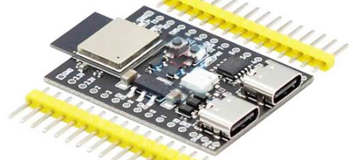

# AI-C3

Add support for the AI-C3 development board with ESP32-C3, Neopixel, serial USB-C and direct USB-C

There are some boards with an ESP32-C3 mini available that look similar to the [ESP32-C3-DevKitM-1-N4](https://circuitpython.org/board/espressif_esp32c3_devkitm_1_n4/) and also have two buttons (Boot on GPIO0 and Reset), a connected Neopixel on GPIO8 (WS2812) and a serial chip CH340K with USB-C. But it also has a __second USB-C__ port that is directly connected to the USB-Pins of the ESP32-C3. The DevKitM build does not activate the serial port on this port nor the storage option. We need a separate build!

## Sources to buy:

- Aliexpress https://vi.aliexpress.com/item/1005004617322170.html 3.12 USD
- Aliexpress https://vi.aliexpress.com/item/32835521420.html 3.85 USD AITEXM ROBOT
- Aliexpress https://vi.aliexpress.com/item/1005004609461716.html 2.93 USD AITEXM ROBOT
- Lazada [link](https://www.lazada.vn/products/esp32-esp32-c3-ai-c3-esp32-c3-devkitm-1-esp32-c3-mini-1-ai-s3-esp32-s3-n16r8-esp32-s3-devkit-c-dual-type-c-usb-development-board-i2429025266-s11992736353.html) 79000 VND

It does not look like any of the [2.1.2 development boards from Ai-Thinker](https://docs.ai-thinker.com/en/esp32c3) to me.

## Images:

From Aliexpress:

source: https://ae01.alicdn.com/kf/Sf5e42e64eb7f465d8f386f8592fac7aad.jpg

From Lazada:

source: https://img.lazcdn.com/g/p/043f963ec228d53cc3c826d455e3900d.jpg_720x720q80.jpg

## Procedure:

Create 5 new files in /ports/espressif/boards/ai-c3

- board.c
- mkconfigboard.h
- mkconfigboard.mk
- pins.c
- sdkconfig

But for the `mkconfigboard.mk` I need a proper CREATOR_ID and CREATION_ID from https://github.com/creationid/creators 

Maybe https://github.com/creationid/creators/blob/main/creations/espressif.md

- 0x00C3_0002 since it is a C3 board and similar to the ESP32-C3-DevKitM-1

And after that there has to be a complete description of this board with pictures and links in https://learn.adafruit.com/how-to-add-a-new-board-to-the-circuitpython-org-website 

So much to do. First let's try to activate this USB port.

Inspiration to be taken from 

- https://circuitpython.org/board/espressif_esp32s3_devkitc_1_n8/
- https://circuitpython.org/board/yd_esp32_s3_n16r8/
- https://circuitpython.org/board/lolin_s3/ - with all descriptions provided by Wemos! Look at https://github.com/adafruit/circuitpython/tree/main/ports/espressif/boards/lolin_s3

All have two USB ports - the second is OTG!

Done by ...
