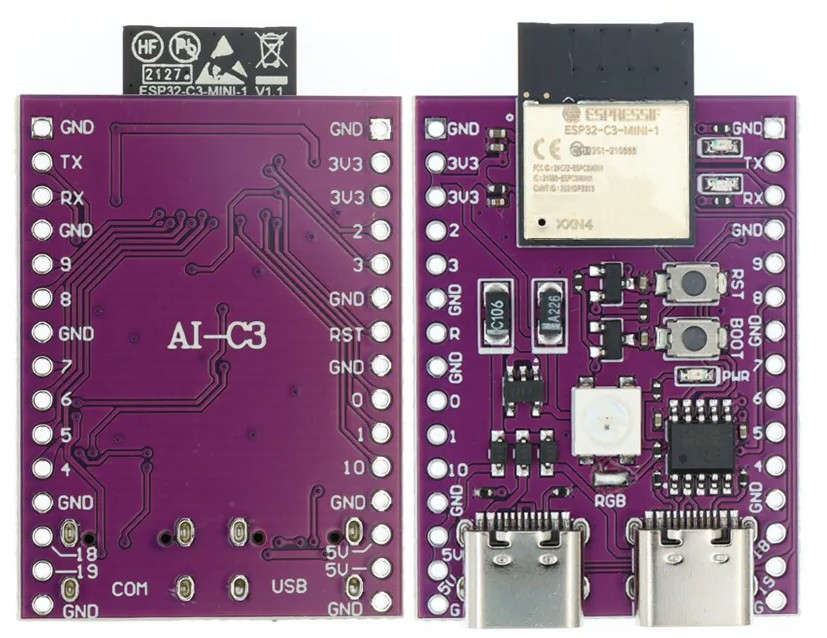
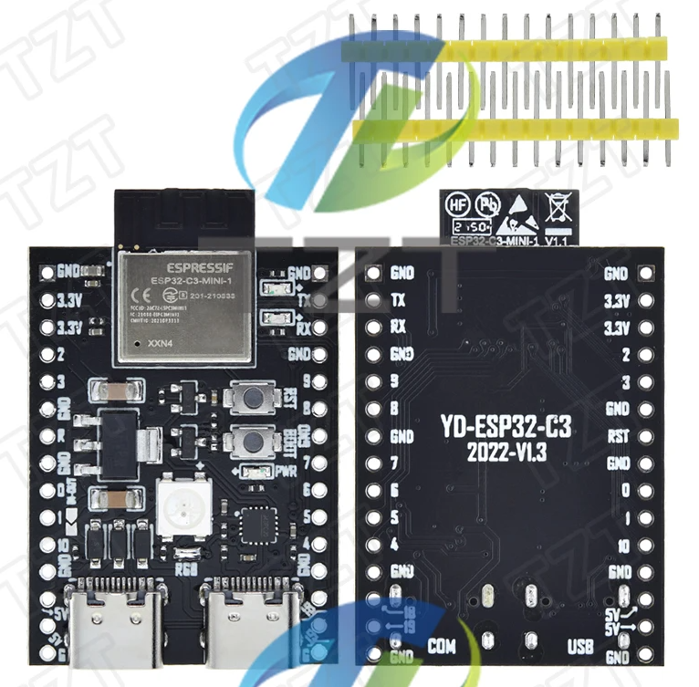
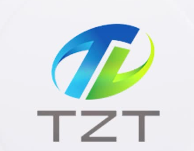
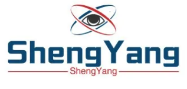

# AI-C3 - who manufactured this board?

In early 2023 I got a board with the name __AI-C3__ silkscreened on it like on this example:

It is still available with this mark at aliexpress. Early 2024 I got a version without any name on silkscreened. And then I found an offering by ShenYang TZT that had the mark __YD-ESP32-C3__ silkscreend. This matches the naming scheme of the __VCC-GND Studio__. They don't have his C3 board [on their website](http://vcc-gnd.com/) but on their [backup website](http://124.222.62.86/yd-data/YD-ESP32-C3/)

## Aliexpress

Here the offering on the official TZT 123 website: 

https://vi.aliexpress.com/item/1005006109704334.html

## Source data from VCC-GND

[Schematics files](ESP32-C3-C/ESP32-C3-C-SCH.pdf) were created in January 2022. And the first mircopython test of the Neopixel connected to pin GPIO8 is dated from November 26, 2021.

## Distributor TZT or ShengYang

Not sure if its different names for the same company. They work hard in Hongkong.

  

See [their company video](TZT.mp4)
